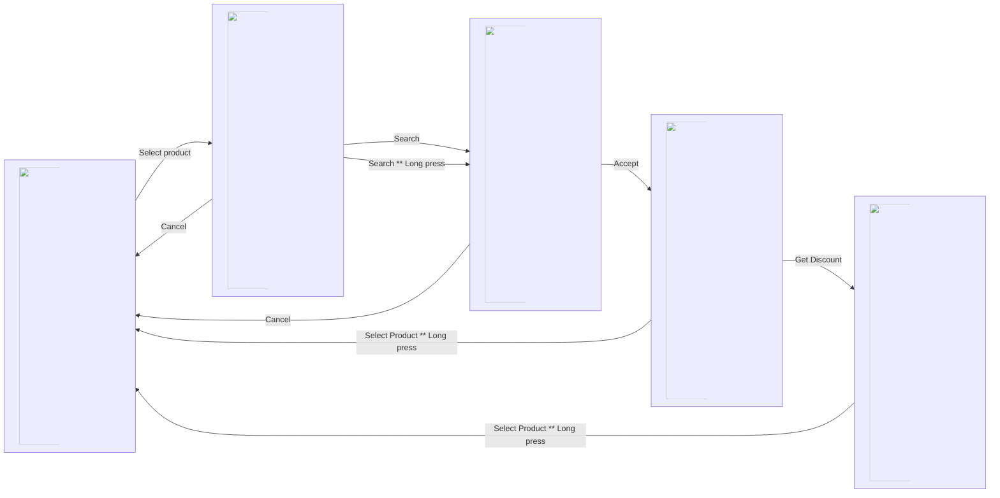

# Product selection:

Simple Android APP to obtain the discount of a product.

## Screenshots

## Features:
- English and Spanish languages.
- Dark and Light themes.
- Custom Styles to implement basic responsive design.