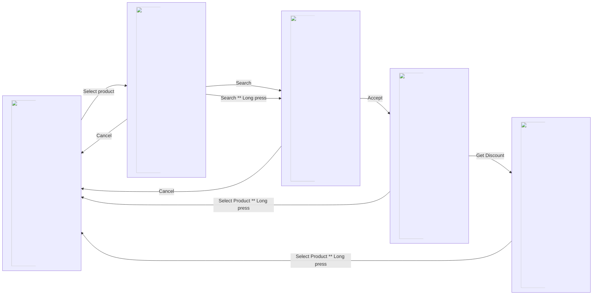

```mermaid
graph LR
    Main[<img src='./img/mainapp.jpg' width='250' height='550' />]
    findById[<img src='./img/find_by_id.jpg' width='250' height='550' />]
    InvalidDiscount[<img src='./img/invalid_discount.jpg' width='250' height='550' />]
    ProductDiscount[<img src='./img/product_discount.jpg' width='250' height='550' />]
    ProductSelected[<img src='./img/product_selected.jpg' width='250' height='550' />]


    Main -- Select product --> findById
    findById -- Search --> ProductSelected
    findById -- Search ** Long press --> ProductSelected
    ProductSelected -- Accept --> InvalidDiscount
    findById -- Cancel --> Main
    ProductSelected -- Cancel --> Main
    InvalidDiscount -- Get Discount --> ProductDiscount
    InvalidDiscount -- Select Product ** Long press --> Main
    ProductDiscount -- Select Product ** Long press --> Main
```